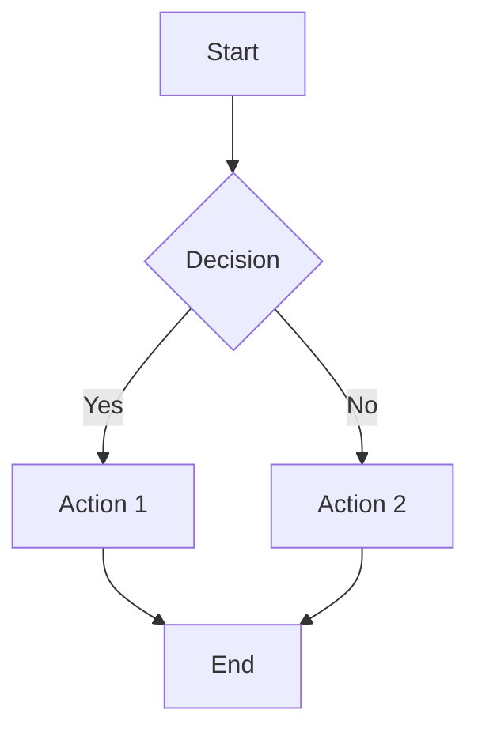

# Markdown Styling Guide

> A comprehensive reference for beautiful markdown formatting

---

## 📚 What's Included

This guide showcases all the styling techniques used in the example files:

1. ✅ **Frontmatter** (YAML metadata)
2. ✅ **Typography & Emphasis**
3. ✅ **Code Blocks & Syntax Highlighting**
4. ✅ **Tables & Lists**
5. ✅ **Callouts & Alerts**
6. ✅ **Diagrams & Visuals**
7. ✅ **Links & References**

---

## 1. Frontmatter (YAML Metadata)

Always include at the top of your markdown files:

```yaml
---
title: "Your Title Here"
subtitle: "Optional subtitle"
date: 2024-01-15
tags: [tag1, tag2, tag3]
category: Category Name
author: Your Name
readTime: "5 min read"
mood: 🎯 focused
status: published
---
```

**Common Fields:**
- `title`: Main heading
- `date`: Publication date
- `tags`: Array of tags for categorization
- `category`: Broad topic grouping
- `status`: draft, published, archived

---

## 2. Typography & Emphasis

### Text Styling

| Markdown | Result |
|----------|--------|
| `**bold text**` | **bold text** |
| `*italic text*` | *italic text* |
| `***bold italic***` | ***bold italic*** |
| `~~strikethrough~~` | ~~strikethrough~~ |
| `` `inline code` `` | `inline code` |

### Blockquotes

```markdown
> Simple quote

> **Quote with** *formatting*
>
> Multiline quote with paragraphs
```

Result:
> Simple quote

> **Quote with** *formatting*
>
> Multiline quote with paragraphs

---

## 3. Code Blocks

### Basic Code Block

````markdown
```javascript
function hello() {
  console.log("Hello, World!");
}
```
````

### With Syntax Highlighting

````markdown
```python
def calculate_fibonacci(n):
    if n <= 1:
        return n
    return calculate_fibonacci(n-1) + calculate_fibonacci(n-2)
```
````

### With Line Numbers & Highlights

````markdown
```javascript {1,3-5}
const greeting = "Hello";  // Line 1
const name = "World";     // Line 2
console.log(greeting);    // Line 3 (highlighted)
console.log(name);        // Line 4 (highlighted)
// ... more code
```
````

### Filename/Path Indicator

````markdown
```bash src/scripts/deploy.sh
#!/bin/bash
echo "Deploying..."
```
````

### Inline Code with Context

Use the backtick for file names, variables, and commands:

```markdown
Edit the `.env` file and set `NODE_ENV=production`.
```

---

## 4. Lists

### Unordered Lists

```markdown
- Item 1
- Item 2
  - Nested item
  - Another nested item
- Item 3
```

**Result:**
- Item 1
- Item 2
  - Nested item
  - Another nested item
- Item 3

### Ordered Lists

```markdown
1. First step
2. Second step
   1. Sub-step 2.1
   2. Sub-step 2.2
3. Third step
```

**Result:**
1. First step
2. Second step
   1. Sub-step 2.1
   2. Sub-step 2.2
3. Third step

### Task Lists

```markdown
- [x] Completed task
- [ ] Incomplete task
- [ ] Task with sub-items
  - [x] Sub-item completed
  - [ ] Sub-item pending
```

**Result:**
- [x] Completed task
- [ ] Incomplete task
- [ ] Task with sub-items
  - [x] Sub-item completed
  - [ ] Sub-item pending

### Definition Lists (Obsidian/Markdown Extra)

```markdown
Term 1
: Definition 1

Term 2
: Definition 2
```

---

## 5. Tables

### Basic Table

```markdown
| Column 1 | Column 2 | Column 3 |
|----------|----------|----------|
| Cell 1   | Cell 2   | Cell 3   |
| Cell 4   | Cell 5   | Cell 6   |
```

**Result:**

| Column 1 | Column 2 | Column 3 |
|----------|----------|----------|
| Cell 1   | Cell 2   | Cell 3   |
| Cell 4   | Cell 5   | Cell 6   |

### Aligned Table

```markdown
| Left | Center | Right |
|:-----|:------:|------:|
| L1   |  C1    |    R1 |
| L2   |  C2    |    R2 |
```

**Result:**

| Left | Center | Right |
|:-----|:------:|------:|
| L1   |   C1   |    R1 |
| L2   |   C2   |    R2 |

### Complex Table with Formatting

```markdown
| Feature | Status | Notes |
|---------|--------|-------|
| **Auth** | ✅ Done | v1.0 |
| *Database* | 🚧 In Progress | ~~v1.1~~ → v1.2 |
| `API` | 📅 Planned | Q2 2024 |
```

**Result:**

| Feature | Status | Notes |
|---------|--------|-------|
| **Auth** | ✅ Done | v1.0 |
| *Database* | 🚧 In Progress | ~~v1.1~~ → v1.2 |
| `API` | 📅 Planned | Q2 2024 |

---

## 6. Callouts & Alerts

### Admonitions (Obsidian, GitHub, etc.)

```markdown
> **NOTE**: Useful information
>
> This is a note callout with multiple paragraphs.
```

> **NOTE**: Useful information
>
> This is a note callout with multiple paragraphs.

### Warning/Alert Blocks

```markdown
> ⚠️ **WARNING**: Important caution
>
> This action cannot be undone!

> 💡 **TIP**: Pro tip
>
> You can use keyboard shortcuts to speed up.
```

> ⚠️ **WARNING**: Important caution
>
> This action cannot be undone!

> 💡 **TIP**: Pro tip
>
> You can use keyboard shortcuts to speed up.

### Custom Callout Styles

```markdown
> **📖 Example**
>
> Here's how it works in practice:
> ```javascript
> console.log("Hello");
> ```

> **❌ Don't**
>
> Don't forget to handle errors!

> **✅ Do**
>
> Always validate user input.
```

> **📖 Example**
>
> Here's how it works in practice:
> ```javascript
> console.log("Hello");
> ```

> **❌ Don't**
>
> Don't forget to handle errors!

> **✅ Do**
>
> Always validate user input.

---

## 7. Links & Images

### Internal Links (Obsidian Wiki-Links)

```markdown
[[Note Name]]
[[Folder/Note Name]]
[[Note Name|Display Text]]
```

### External Links

```markdown
[Link text](https://example.com)
[Link with title](https://example.com "Hover text")
```

### Images

```markdown


![[embedded-image.png]]  # Obsidian embed
```

### Link with Reference Style

```markdown
[Link text][reference]

[reference]: https://example.com "Optional title"
```

---

## 8. Horizontal Rules & Dividers

```markdown
---

***

___
```

All render as:
---

---

## 9. Headings & Document Structure

```markdown
# Main Title (H1)

## Section (H2)

### Subsection (H3)

#### Sub-subsection (H4)

##### Minor heading (H5)

###### Tiny heading (H6)
```

### Heading Best Practices

- Start with H1 (only one per document)
- Use H2 for main sections
- Use H3-H4 for subsections
- Keep heading hierarchy logical
- Don't skip levels (H2 → H4)

---

## 10. Special Elements

### Footnotes

```markdown
Here's a statement with a footnote[^1].

[^1]: This is the footnote text.
```

### Abbreviations

```markdown
*[HTML]: HyperText Markup Language
*[CSS]: Cascading Style Sheets
```

### Math (KaTeX/MathJax)

```markdown
Inline math: $E = mc^2$

Block math:
$$
\int_{a}^{b} x^2 dx = \frac{b^3}{3} - \frac{a^3}{3}
$$
```

### Mermaid Diagrams

```markdown

````

### Escaping Characters

To show markdown symbols as literal text:

```markdown
\*not italic\*
\`\`not code\`\`
\[not a link\]
```

---

## 11. Keyboard Keys

```markdown
Press <kbd>Ctrl</kbd> + <kbd>S</kbd> to save.

Use <kbd>⌘</kbd> + <kbd>C</kbd> on Mac.
```

Result:

Press <kbd>Ctrl</kbd> + <kbd>S</kbd> to save.

Use <kbd>⌘</kbd> + <kbd>C</kbd> on Mac.

---

## 12. Badges & Metadata

```markdown


```

---

## 13. Collapsible Sections (HTML Details)

```markdown
<details>
<summary>Click to expand</summary>

This content is hidden by default!

- Can include lists
- Code blocks
- And more!

</details>
```

Result:
<details>
<summary>Click to expand</summary>

This content is hidden by default!

- Can include lists
- Code blocks
- And more!

</details>

---

## 14. Metadata Headers

```markdown
---
title: "Document Title"
date: 2024-01-15
tags: [markdown, guide]
---

Alternative JSON frontmatter (Hugo, etc.):
+++
title = "Document Title"
date = 2024-01-15
tags = ["markdown", "guide"]
+++
```

---

## 📋 Quick Reference Card

| Element | Syntax |
|---------|--------|
| **Bold** | `**text**` |
| *Italic* | `*text*` |
| `Code` | `` `code` `` |
| [Link](url) | `[text](url)` |
|  | `` |
| > Quote | `> quote` |
| - List | `- item` |
| 1. List | `1. item` |
| \| Table \| | `\| col \|` |
| # Heading | `# heading` |
| --- | `---` |
| [x] Task | `- [x] task` |

---

## 🎨 Styling Tips

### Color Coding (HTML)

```markdown
<span style="color: red">Red text</span>
<span style="color: green">Green text</span>
<span style="color: blue">Blue text</span>
```

### Highlighting (Obsidian)

```markdown
==highlighted text==
```

### Superscript & Subscript

```markdown
H<sub>2</sub>O
x<sup>2</sup>
```

---

## 📝 Document Templates

### Technical Tutorial Template

```markdown
---
title: "Tutorial Title"
category: Technical
difficulty: Intermediate
readTime: "10 min"
---

# Tutorial Title

> **Learning Objective**: What readers will learn

## Prerequisites
- Requirement 1
- Requirement 2

## Overview
Brief description...

## Step 1: First Step
Content...

## Step 2: Next Step
Content...

## Summary
Recap...
```

### Blog Post Template

```markdown
---
title: "Catchy Title"
subtitle: "Engaging subtitle"
date: YYYY-MM-DD
tags: [tag1, tag2]
category: Blog
---

# Catchy Title

*Engaging subtitle*

> Featured quote

## Introduction
Hook your readers...

## Main Point 1
Content...

## Main Point 2
Content...

## Conclusion
Wrap up with key takeaways...

## Call to Action
Invite engagement!
```

---

**💡 Pro Tip**: Use this guide as a reference when creating new markdown files. Copy relevant sections and adapt them to your content!

---

*Last Updated: January 15, 2024*
