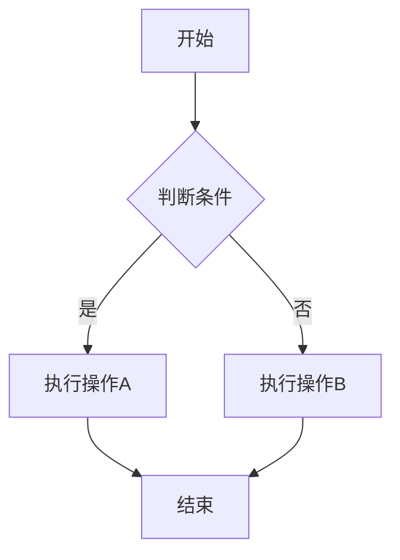
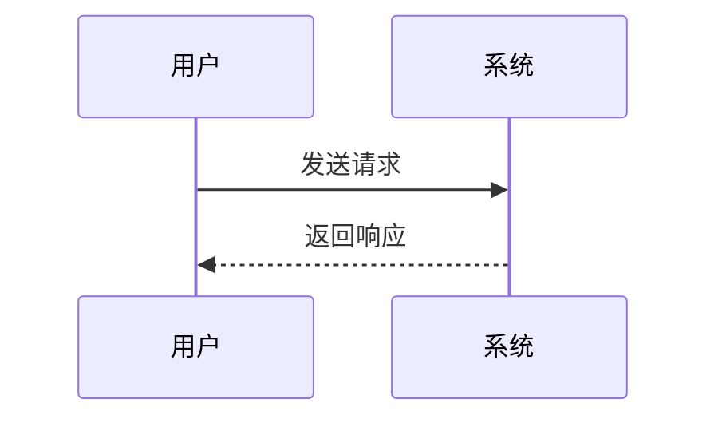

# Markdown 教程

这是一份全面的 Markdown 排版教程，展示了各种常用的 Markdown 语法和排版技巧。

---

## 1. 文本格式化

### 粗体、斜体和删除线

- **粗体文字**：使用 `**文字**` 或 `__文字__`
- *斜体文字*：使用 `*文字*` 或 `_文字_`
- ***粗斜体文字***：使用 `***文字***` 或 `___文字___`
- ~~删除线文字~~：使用 `~~文字~~`

### 行内代码

在段落中使用 `行内代码`，可以通过反引号 `` ` `` 实现。

### 上标和下标

水的化学式是 H~2~O（需要特定渲染器支持）。
面积单位是 m^2^（需要特定渲染器支持）。

---

## 2. 标题层级

# 一级标题
## 二级标题
### 三级标题
#### 四级标题
##### 五级标题
###### 六级标题

---

## 3. 列表

### 无序列表

- 第一项
- 第二项
  - 嵌套项目 1
  - 嵌套项目 2
- 第三项

也可以使用：
* 第一项
+ 第一项

### 有序列表

1. 第一项
2. 第二项
3. 第三项
   1. 嵌套有序项目
   2. 另一个嵌套项目

### 任务列表

- [x] 已完成的任务
- [ ] 未完成的任务
- [ ] 待办事项

---

## 4. 链接

### 行内链接

[GitHub](https://github.com)

### 带标题的链接

[GitHub](https://github.com "访问 GitHub")

### 引用式链接

[GitHub][1] 或使用 [Obsidian][2]

[1]: https://github.com
[2]: https://obsidian.md

---

## 5. 图片

### 行内图片


### 带标题和尺寸的图片


### 本地图片

如果使用 Obsidian，可以使用 `![[图片名称.png]]` 语法嵌入本地图片。

---

## 6. 引用

> 这是一段引用文字。
>
> 可以有多行。
>
>> 甚至可以嵌套引用。

### 引用中包含其他元素

> **引用中的粗体**
>
> - 列表项 1
> - 列表项 2
>
> ```js
> console.log("引用中的代码");
> ```

---

## 7. 代码块

### 行内代码

使用 `` `代码` `` 可以创建行内代码。

### 代码块（指定语言）

```javascript
function greet(name) {
    console.log(`Hello, ${name}!`);
    return `Welcome, ${name}`;
}

greet("World");
```

```python
def fibonacci(n):
    if n <= 1:
        return n
    return fibonacci(n-1) + fibonacci(n-2)

print(fibonacci(10))
```

```bash
# 这是一个 shell 脚本示例
echo "Hello, World!"
git status
ls -la
```

### 不指定语言的代码块

```
这是一段普通文本代码块
没有语法高亮
```

---

## 8. 分隔线

使用三个或更多的星号、减号或下划线：

***

---

___

---

## 9. 表格

### 基本表格

| 列1 | 列2 | 列3 |
|-----|-----|-----|
| 数据1 | 数据2 | 数据3 |
| 数据4 | 数据5 | 数据6 |

### 对齐方式

| 左对齐 | 居中 | 右对齐 |
|:-------|:----:|-------:|
| 内容1 | 内容2 | 内容3 |
| 长内容 | 中间 | 靠右 |

### 复杂表格

| 功能 | 语法 | 示例 |
|:-----|:-----|:-----|
| **粗体** | `**文字**` | **这是粗体** |
| *斜体* | `*文字*` | *这是斜体* |
| `代码` | `` `代码` `` | `行内代码` |
| [链接](https://example.com) | `[文本](url)` | [访问](https://example.com) |

---

## 10. 脚注

这是一个包含脚注的句子[^1]。

这是另一个脚注[^note]。

[^1]: 这是第一个脚注的内容。
[^note]: 这是一个命名脚注。

---

## 11. HTML 支持

### 高亮文本

使用 ==高亮文本==（需要特定渲染器）

或者使用 HTML：

<mark>这是高亮的文本</mark>

### 键盘快捷键

使用 <kbd>Ctrl</kbd> + <kbd>C</kbd> 复制文本

### 自定义样式

<div style="color: red; font-weight: bold;">这是红色粗体文字</div>

---

## 12. 数学公式（需要 MathJax 支持）

### 行内公式

爱因斯坦质能方程：$E = mc^2$

### 块级公式

$$
\frac{n!}{k!(n-k)!} = \binom{n}{k}
$$

$$
\begin{align}
f(x) &= x^2 + 2x + 1 \\
f'(x) &= 2x + 2
\end{align}
$$

---

## 13. 折叠内容（需要特定渲染器）

<details>
<summary>点击展开查看更多</summary>

这里是隐藏的内容，只有点击后才会显示。

可以包含多行内容：

- 列表项 1
- 列表项 2
- 列表项 3

</details>

---

## 14. Emoji 表情

:smile: :heart: :thumbsup: :rocket: :fire:

常用 Emoji：
- :check_mark: - 完成标记
- :x: - 错误标记
- :warning: - 警告
- :information_source: - 信息
- :bulb: - 想法

---

## 15. Mermaid 图表（需要特定渲染器）

### 流程图



### 时序图



---

## 16. 快捷键和技巧

| 操作 | Markdown 语法 |
|:-----|:--------------|
| 转义字符 | 在特殊字符前加 `\`，如 `\*` 显示为 `*` |
| 强制换行 | 行尾加两个空格 |
| 注释 | `<!-- 这是注释 -->`（HTML 注释） |
| 自动链接 | 直接写 URL，如 https://github.com |

---

## 17. 最佳实践

1. **保持一致性**：在整个文档中使用相同的语法风格
2. **简洁明了**：不要过度使用格式化
3. **适当留白**：使用空行分隔不同部分
4. **代码高亮**：为代码块指定正确的语言
5. **描述性链接**：链接文字应描述目标内容
6. **图片 alt 文本**：为图片添加描述性 alt 文本

---

## 结语

这就是 Markdown 的基础教程！通过这些语法，你可以创建结构清晰、格式美观的文档。

> 有问题？查看 [Markdown 官方指南](https://www.markdownguide.org/) 获取更多信息。

---

*最后更新：2026-01-16*
