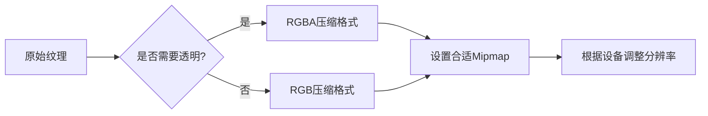

# Unity 性能优化方案

> 本文档记录了Unity项目开发中常见的性能优化策略和最佳实践

---

## 📊 目录

- [渲染优化](#渲染优化)
- [内存优化](#内存优化)
- [CPU优化](#cpu优化)
- [物理优化](#物理优化)
- [音频优化](#音频优化)
- [代码优化](#代码优化)

---

## 🎨 渲染优化

### Draw Call 优化

| 优化项 | 说明 | 预期效果 |
|--------|------|----------|
| **合批渲染** | 使用动态合批(Dynamic Batching)或GPU Instancing | 减少Draw Call数量 |
| **图集合并** | 将小纹理合并成大图集 | 减少材质切换 |
| **遮罩剔除** | 启用Occlusion Culling | 避免渲染不可见物体 |

> 💡 **提示**: 检查Draw Call可使用 Frame Debugger 或 Profiler

### 纹理优化



- ✅ 使用合适的压缩格式 (ASTC/ETC2/PVRTC)
- ✅ 启用 Mipmap 用于3D物体
- ❌ 禁用UI纹理的Mipmap
- ✅ 根据设备分档调整纹理质量

### 着色器优化

- 避免使用复杂的光照计算
- 使用 **Mobile/VertexLit** 等简化Shader
- 减少 **Shader变体** 数量
- 使用 **Shader LOD** 控制

---

## 💾 内存优化

### 纹理内存

```
📏 纹理内存计算公式:
内存 = 宽 × 高 × 像素格式字节数 × Mipmap层数
```

| 格式 | 每像素字节数 | 适用场景 |
|------|-------------|----------|
| RGB24 | 3字节 | 高质量纹理 |
| RGBA32 | 4字节 | 带透明通道 |
| ETC2 | 0.5-1字节 | Android通用 |
| ASTC 4x4 | 0.5字节 | iOS/现代Android |

### 资源管理

```csharp
// ✅ 推荐: 使用对象池
GameObject obj = objectPool.Get();
// ... 使用完毕
objectPool.Return(obj);

// ❌ 避免: 频繁Instantiate/Destroy
Instantiate(prefab);
Destroy(gameObject);
```

- 使用 **Addressables** 或 **AssetBundle** 管理资源
- 实现 **对象池** 复用常用对象
- 及时 **卸载未使用资源** (`Resources.UnloadUnusedAssets()`)

### 内存分析工具

- **Unity Profiler**: 实时监控内存
- **Memory Profiler**: 深度内存快照分析
- **Xcode Instruments**: iOS内存分析

---

## ⚡ CPU优化

### 脚本优化

| 优化点 | 说明 |
|--------|------|
| **缓存组件引用** | 避免每帧 `GetComponent` |
| **使用对象池** | 减少GC压力 |
| **减少空引用检查** | 结构体使用 `Nullable<T>` |
| **使用StringBuilder** | 替代字符串拼接 |

```csharp
// ✅ 优化前
void Update() {
    var rb = GetComponent<Rigidbody>();
    rb.velocity = Vector3.forward;
}

// ✅ 优化后
private Rigidbody rb;

void Awake() {
    rb = GetComponent<Rigidbody>();
}

void Update() {
    rb.velocity = Vector3.forward;
}
```

### Update调用优化

- 合并多个 **Update** 为一个
- 使用 **协程** 替代频繁Update
- 考虑使用 **事件驱动** 模式

```csharp
// ✅ 使用协程控制频率
IEnumerator UpdateEverySecond() {
    while (true) {
        ProcessLogic();
        yield return new WaitForSeconds(1f);
    }
}
```

### 垃圾回收 (GC) 优化

> 🎯 **目标**: 每帧GC分配 < 16KB

- 避免在Update中分配内存
- 使用 **预分配数组**
- 减少 **装箱/拆箱** 操作
- 合理使用 **结构体 vs 类**

---

## 🏀 物理优化

### 物理设置

```yaml
Fixed Timestep: 0.02s (50Hz)
Maximum Allowed Timestep: 0.1s
Solver Iteration Count: 6-8
```

### 碰撞优化

| 优化项 | 配置 |
|--------|------|
| **碰撞体** | 使用简单碰撞体(盒/球/胶囊)替代网格碰撞体 |
| **Layer矩阵** | 关闭不需要的Layer碰撞检测 |
| **睡眠模式** | 启用Rigidbody睡眠 |

### 物理调试

- 使用 **Physics Debug可视化**
- 监控 **Physics.Processing** 时间
- 控制物理对象数量

---

## 🔊 音频优化

### 音频压缩

| 格式 | 比特率 | 适用场景 |
|------|--------|----------|
| Vorbis | 64-128kbps | 通用音效/音乐 |
| PCM | 1411kbps | 短音效(<5秒) |
| ADPCM | 352kbps | 中等长度音效 |

### 音频优化建议

- ✅ 长音效使用 **压缩格式**
- ✅ 短音效使用 **PCM或ADPCM**
- ✅ 启用 **音频流加载** (长音乐)
- ✅ 控制同时播放音源数量
- ✅ 使用 **对象池** 管理AudioSource

---

## 💻 代码优化

### LINQ 避免使用

```csharp
// ❌ 避免在热路径使用LINQ
var result = list.Where(x => x.active).ToList();

// ✅ 使用传统循环
List<Item> result = new List<Item>();
foreach (var item in list) {
    if (item.active) result.Add(item);
}
```

### 字符串处理

```csharp
// ❌ 频繁拼接
string str = "";
for (int i = 0; i < 1000; i++) {
    str += i;
}

// ✅ 使用StringBuilder
StringBuilder sb = new StringBuilder();
for (int i = 0; i < 1000; i++) {
    sb.Append(i);
}
string str = sb.ToString();
```

### 数学运算优化

```csharp
// ❌ 避免每帧计算
float distance = Vector3.Distance(a, b);

// ✅ 使用平方距离比较
float sqrDistance = (a - b).sqrMagnitude;
if (sqrDistance < threshold * threshold) { ... }
```

---

## 📱 移动平台专项

### 图形API选择

| 平台 | 推荐API |
|------|---------|
| iOS | Metal |
| Android | Vulkan / GLES 3.2+ |
| 低端设备 | GLES 3.0 |

### 多线程渲染

- 启用 **Multithreaded Rendering**
- 使用 **GPU Instancing**
- 配置合理的 **Graphics Jobs**

### 电量优化

- 降低帧率 (30fps vs 60fps)
- 减少物理模拟精度
- 优化光照计算
- 批量处理网络请求

---

## 🔧 性能分析工具

| 工具 | 用途 |
|------|------|
| **Unity Profiler** | 实时性能分析 |
| **Frame Debugger** | 逐帧渲染分析 |
| **Memory Profiler** | 内存泄漏检测 |
| **RenderDoc** | GPU调试 |
| **Xcode Instruments** | iOS性能分析 |
| **Android Profiler** | Android性能分析 |

---

## 📈 性能目标参考

| 指标 | 目标值 |
|------|--------|
| **帧率** | ≥ 60 FPS (高端) / ≥ 30 FPS (低端) |
| **Draw Call** | < 100 (Mobile) |
| **三角面** | < 100K/屏 |
| **内存** | < 512MB (iOS) / < 1GB (Android) |
| **包体** | < 150MB (推荐) |

---

> 📝 **最后更新**: 2026-01-16
> 🏷️ **标签**: #Unity #性能优化 #BestPractices

---

## 相关链接

- [Unity性能优化官方文档](https://docs.unity3d.com/Manual/MobileOptimizationPracticalGuide.html)
- [Unity Manual - Optimizing Scripts](https://docs.unity3d.com/Manual/MobileOptimizationPracticalScriptingOptimization.html)
